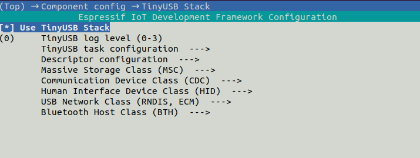
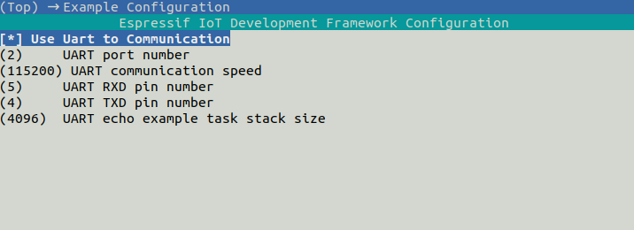

# ESP32-S USB Dongle Solution

## 1.Overview

This example shows how to set up ESP32-S chip to work as a USB Dongle Device.

Supports the following functions:

* Support Host to surf the Internet wirelessly via USB-RNDIS.
* Add BLE devices via USB-BTH, support scan, broadcast, connect and other functions.
* Support Host to communicate and control ESP32-S series devices via USB-CDC or UART.
* Support system commands and Wi-Fi control commands. It uses FreeRTOS-Plus-CLI interfaces, so it is easy to add more commands.
* Support hot swap.

## 2.How to use example

### 2.1 Hardware Preparation

Any ESP boards that have USB-OTG supported.

* ESP32-S2

* ESP32-S3

### 2.2 Hardware Connection

Pin assignment is only needed for ESP chips that have an USB-OTG peripheral. If your board doesn't have a USB connector connected to the USB-OTG dedicated GPIOs, you may have to DIY a cable and connect **D+** and **D-** to the pins listed below.

```
ESP BOARD          USB CONNECTOR (type A)
                          --
                         | || VCC
[USBPHY_DM_NUM]  ------> | || D-
[USBPHY_DP_NUM]  ------> | || D+
                         | || GND
                          --
```

Refer to `soc/usb_pins.h` to find the real GPIO number of **USBPHY_DP_NUM** and **USBPHY_DM_NUM**.

|             | USB_DP | USB_DM |
| ----------- | ------ | ------ |
| ESP32-S2/S3 | GPIO20 | GPIO19 |

* ESP32-S2-Saola


* ESP32-S3 DevKitC


### 2.3 Software Preparation

* Confirm that the ESP-IDF environment is successfully set up, and fall back to the specified commit.

    ```
    >git pull
    >git reset --hard 5f38b766a8
    >git submodule update --init --recursive
    >
    ```

* To add ESP-IDF environment variables. If you are using Linux OS, you can follow below steps. If you are using other OS, please refer to [Set up the environment variables](https://docs.espressif.com/projects/esp-idf/en/latest/esp32/get-started/index.html#step-4-set-up-the-environment-variables).

    ```
    >cd esp-idf
    >./install.sh
    >. ./export.sh
    >
    ```

* Confirm that the `ESP-IOT-SOLUTION` repository has been completely downloaded, and switch to the `usb/add_usb_solutions` branch.

    ```
    >git clone -b usb/add_usb_solutions --recursive https://github.com/espressif/esp-iot-solution
    >cd esp-iot-solution/example/usb/device/usb_dongle
    >
    ```
    
* Set the compilation target to `esp32s2` or `esp32s3`

    ```
    >idf.py set-target esp32s2
    >
    ```

### 2.4 Project Configuration





Currently USB-Dongle supports the following four combination options.

| RNDIS | BTH  | CDC  | UART |
| :---: | :--: | :--: | :--: |
|   √   |      |      |  √   |
|   √   |      |  √   |      |
|   √   |  √   |      |  √   |
|       |  √   |      |  √   |

* UART is disabled by default when CDC is enabled.
* The project enables RNDIS and CDC by default.
* You can select USB Device through `component config -> TinyUSB Stack`.
* When RNDIS and BTH are enabled at the same time, it is recommended to disable CDC, use UART to send commands, and configure the serial port through `Example Configuration`.

>Due to current hardware limitations, the number of EndPoints cannot exceed a certain number, so RNDIS, BTH, and CDC should not be all enabled at the same time.

### 2.5 build & flash & monitor

You can use the following command to build and flash the firmware.

```
>idf.py -p (PORT) build flash monitor
>
```

 * Replace ``(PORT)`` with the actual name of your serial port.

 * To exit the serial monitor, type `Ctrl-]`.

### 2.6 User Guide

1. After completing above preparation, you can connect PC and your ESP device with USB cable.

2. You can see a USB network card and a bluetooth device on your PC.

    * Show network devices

    ```
    >ifconfig -a
    >
    ```

    

    * Show bluetooth device

    ```
    >hciconfig
    >
    ```

    

    Show USB-CDC device

    ```
    >ls /dev/ttyACM*
    >
    ```

    

3. The PC can communicate with the ESP board through the USB ACM port or UART. And you can use ``help`` command to view all commands supported.

    > When communicating with ESP device, add **LF(\n)** at the end of the command

4. If USB-RNDIS is enabled, you can connect ESP device to AP by commands.
    * [Connect to target AP by sta command](./Commands_EN.md#3sta)
    * [Connect to target AP by startsmart command (SmartConfig)](./Commands_EN.md#5smartconfig)

## 3. Connect to a Wi-Fi AP

The example provides two methods to connect ESP device to a Wi-Fi AP.

### [Method 1. Connect to target AP by `sta` command](./Commands_EN.md#3sta)

**Command Example**

```
sta -s <ssid> -p [<password>]
```

**Notes**

* `password` is optional

* When the USB Dongle network is switched, the network device needs to be reloaded

    >find USB Ethernet name
    >
    >```
    >>ifconfig
    >>
    >```
    >
    >unload USB Ethernet 
    >
    >```
    >>ifconfig <USB Ethernet name> down
    >>
    >```
    >
    >reload USB Ethernet 
    >
    >```
    >>ifconfig <USB Ethernet name> up
    >>
    >```
    >
    >* `USB Ethernet name` is the name of the queried network device

### [Method 2. Connect to target AP by startsmart command (SmartConfig)](./Commands_EN.md#5smartconfig)

(1) Hardware Required

Download ESPTOUCH APP from app store: [Android source code](https://github.com/EspressifApp/EsptouchForAndroid) [iOS source code](https://github.com/EspressifApp/EsptouchForIOS) is available.

(2) Make sure your phone connect to the target AP (2.4GHz).

(3) Open ESPTOUCH app and input password.

(4) Send commands via USB ACM port

**Example**

```
smartconfig 1
```

**Notes**

* When the USB Dongle network is switched, the network device needs to be reloaded

    >find USB Ethernet name
    >
    >```
    >>ifconfig
    >>
    >```
    >
    >unload USB Ethernet 
    >
    >```
    >>ifconfig <USB Ethernet name> down
    >>
    >```
    >
    >reload USB Ethernet 
    >
    >```
    >>ifconfig <USB Ethernet name> up
    >>
    >```
    >
    >* `USB Ethernet name` is the name of the queried network device

## 4.Command introduction

[Commands](./Commands_EN.md)

Note: Wi-Fi commands can only be used when USB Network Class is enabled
